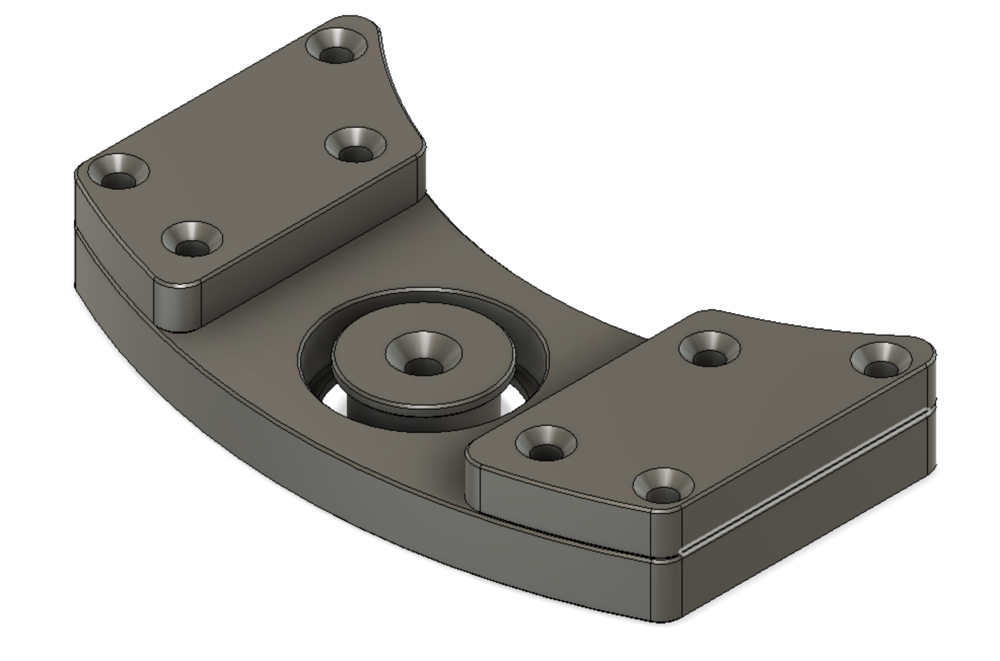
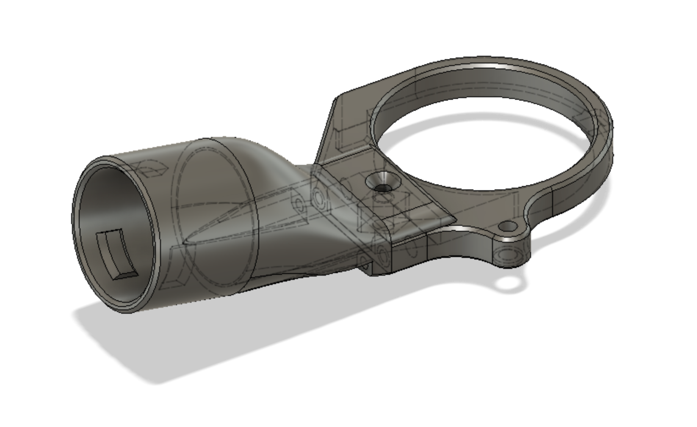

# Makita DRT50RTJX2 Oberfräse

## Hole Cutting Jig

* 2x 8mm Führungstangen
* 1x 32x20x7mm (6804) Lager
 
## Festool Adapter

* 3x M4 Heatinserts
* 2x M4x12 DIN912 Schraube
* 1x M4x12 DIN7991 Schraube
